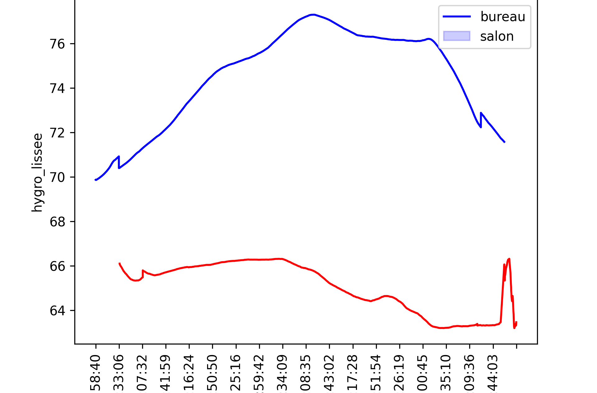
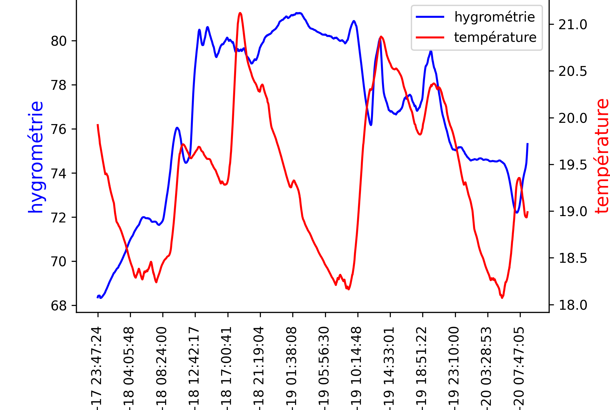

Etude des températures et de l'hygrométrie pour optimisation de la consommation domestique
==========
Ecriture d'un programme Python permettant de réaliser des visualisations concernant l'évolution des températures et de l'hygrométrie de différentes pièces de la maison à partir de données brutes recupérées via des capteurs au format csv.
La principale difficulté a été de nettoyer le jeu de données qui contenait de nombreux outliers, comme vous pouvez le voir sur les premiers schéma comparant les courbe de température et d'hygrométrie avant et après nettoyage.

<table>
<tr>
<td></td>
<td></td>
</tr>
<tr>
<td>Fig1: Température avec et sans outliers </td>
<td>Fig2: Hygrométrie avec et sans outliers </td>
</tr>
</table>

Premier jeu de données : température et hygrométrie de deux pièces, bureau et salon, sur 24 heures.
-------------------

<table>
<tr>
<td></td>
<td></td>
</tr>
<tr>
<td>Fig1: Evolution de l'hygrométrie et de la température dans le bureau </td>
<td>Fig2: Evolution de l'hygrométrie dans le salon et le bureau</td>
</tr>
</table>

-----------
Deuxième jeu de données : température et hygrométrie du salon sur 72 heures.

<table>
<tr>
<td></td>
</tr>
<tr>
<td>Fig1: Evolution de la température et de l'hygrométrie du salon</td>
</tr>
</table>
-----------
